# 第三篇：Serverless与人工智能实现微信公众号的智能服务

## 前言
传统意义上来说，想给微信公众号增加更多的功能，需要我们有一台服务器，搭建一个微信公众号的后台服务。那么在Serverless架构下，我们是否有超简便的方法来实现一个简单的微信公众号后台呢？  

## 初步搭建

### Serverless原生开发

首先我们要提前准备一个微信公众号；接下来，我们要为我们的函数计算服务申请固定IP：

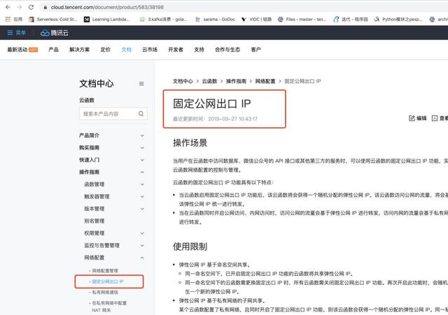


点击白名单之后，我们可以填写表单，完成固定公网出口IP的申请，这里可能要几个工作日才能完成。

接下来就是我们的代码开发。

1. 想要将函数绑定到公众号后台，需要我们参考文档：https://developers.weixin.qq.com/doc/offiaccount/Basic_Information/Access_Overview.html
我们可以先在函数中按照文档完成一个基本的鉴定功能：  

```python
def checkSignature(param):
    '''
    文档地址：https://developers.weixin.qq.com/doc/offiaccount/Basic_Information/Access_Overview.html
    :param param:
    :return:
    '''
    signature = param['signature']
    timestamp = param['timestamp']
    nonce = param["nonce"]
    tmparr = [wxtoken, timestamp, nonce]
    tmparr.sort()
    tmpstr = ''.join(tmparr)
    tmpstr = hashlib.sha1(tmpstr.encode("utf-8")).hexdigest()
    return tmpstr == signature
```

再定义一个基本的回复方法：

```python
def response(body, status=200):
    return {
        "isBase64Encoded": False,
        "statusCode": status,
        "headers": {"Content-Type": "text/html"},
        "body": body
    }
```

然后在函数入口处：  

```python
def main_handler(event, context):    
    if 'echostr' in event['queryString']:  # 接入时的校验
        return response(event['queryString']['echostr'] if checkSignature(event['queryString']) else False)
```

我们接着配置我们Yaml：  

```yaml
# serverless.yml
Weixin_GoServerless:
  component: "@serverless/tencent-scf"
  inputs:
    name: Weixin_GoServerless
    codeUri: ./Admin
    handler: index.main_handler
    runtime: Python3.6
    region: ap-shanghai
    description: 微信公众号后台服务器配置
    memorySize: 128
    timeout: 20
    environment:
      variables:
        wxtoken: 自定义一个字符串
        appid: 暂时不写
        secret: 暂时不写
    events:
      - apigw:
          name: Weixin_GoServerless
          parameters:
            protocols:
              - https
            environment: release
            endpoints:
              - path: /
                method: ANY
                function:
                  isIntegratedResponse: TRUE
```

我们执行代码，完成部署：

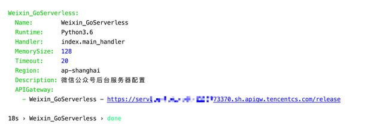

接下来在我们的公众号后台，选择基本配置：

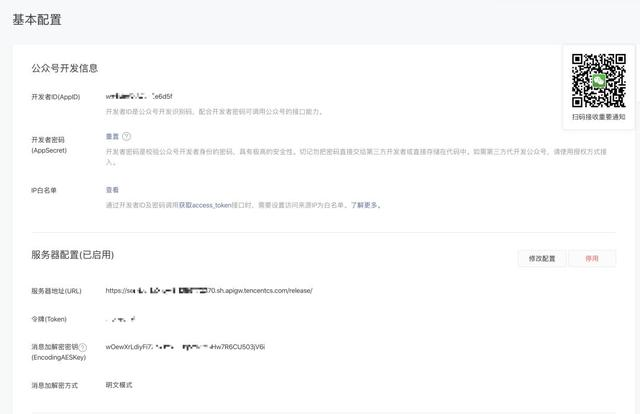

然后选择修改配置：

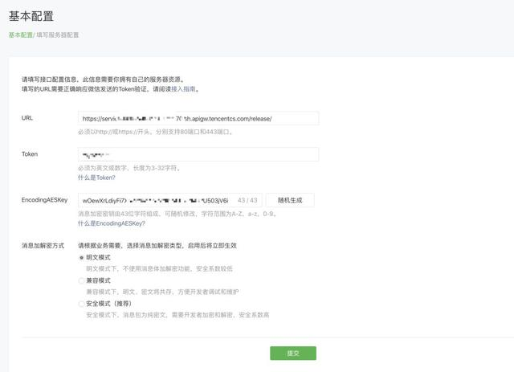

在这里我们要注意：

  * URL，写我们刚才部署完成返回给我们的地址，并且在最后加一个/

  * Token，写我们Yaml中的wxtoken，两个地方要保持一样的字符串

  * EncodingAESKey，可以点击随机生成

  * 消息加密方法可以选择明文

完成之后，我们可以点击提交：


看到提交成功，就说明我们已经完成了第一步骤的绑定，接下来，我们到函数的后台：

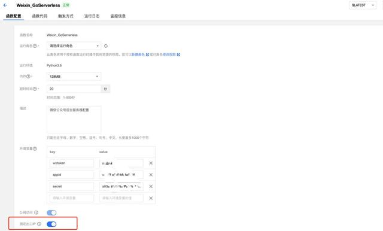

打开这个固定出口IP，然后看到IP地址之后，复制IP地址：

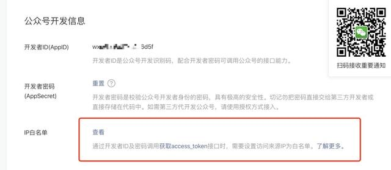

点击查看->修改，并将IP地址复制粘贴进来，保存。  
同时我们查看开发者ID和密码：

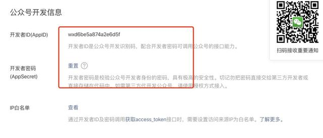

并将这两个内容复制粘贴，放到我们环境变量中：  

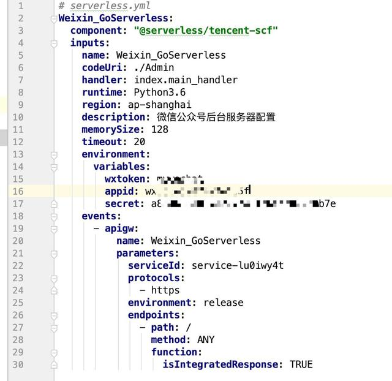

至此，我们完成了一个公众号后台服务的绑定。为了方便之后的操作，我先获取一下全局变量：

```python
wxtoken = os.environ.get('wxtoken')
appid = os.environ.get('appid')
secret = os.environ.get('secret')
```

2. 接下来对各个模块进行编辑（本文只提供部分简单基础的模块，更多功能实现可以参考微信公众号文档实现）

* 获取AccessToken模块：

```python
def getAccessToken():
    '''
    文档地址：https://developers.weixin.qq.com/doc/offiaccount/Basic_Information/Get_access_token.html
    正常返回：{"access_token":"ACCESS_TOKEN","expires_in":7200}
    异常返回：{"errcode":40013,"errmsg":"invalid appid"}
    :return:
    '''
    url = "https://api.weixin.qq.com/cgi-bin/token?grant_type=client_credential&appid=%s&secret=%s" % (appid, secret)
    accessToken = json.loads(urllib.request.urlopen(url).read().decode("utf-8"))
    print(accessToken)
    return None if "errcode" in accessToken else accessToken["access_token"]
```

* 创建自定义菜单模块：  

```python
def setMenu(menu):
    '''
    文档地址：https://developers.weixin.qq.com/doc/offiaccount/Custom_Menus/Creating_Custom-Defined_Menu.html
    正确返回：{"errcode":0,"errmsg":"ok"}
    异常返回：{"errcode":40018,"errmsg":"invalid button name size"}
    :return:
    '''
    accessToken = getAccessToken()
    if not accessToken:
        return "Get Access Token Error"

    url = "https://api.weixin.qq.com/cgi-bin/menu/create?access_token=%s" % accessToken
    postData = urllib.parse.urlencode(menu).encode("utf-8")
    requestAttr = urllib.request.Request(url=url, data=postData)
    responseAttr = urllib.request.urlopen(requestAttr)
    responseData = json.loads(responseAttr.read())
    return responseData['errmsg'] if "errcode" in responseData else "success"
```

* 常见消息回复模块：  

```python
def textXML(body, event):
    '''
    :param body: {"msg": "test"}
        msg: 必填，回复的消息内容（换行：在content中能够换行，微信客户端就支持换行显示）
    :param event:
    :return:
    '''
    return """<xml><ToUserName><![CDATA[{toUser}]]></ToUserName>
              <FromUserName><![CDATA[{fromUser}]]></FromUserName>
              <CreateTime>{time}</CreateTime>
              <MsgType><![CDATA[text]]></MsgType>
              <Content><![CDATA[{msg}]]></Content></xml>""".format(toUser=event["FromUserName"],
                                                                   fromUser=event["ToUserName"],
                                                                   time=int(time.time()),
                                                                   msg=body["msg"])


def pictureXML(body, event):
    '''
    :param body:  {"media_id": 123}
        media_id: 必填，通过素材管理中的接口上传多媒体文件，得到的id。
    :param event:
    :return:
    '''
    return """<xml><ToUserName><![CDATA[{toUser}]]></ToUserName>
              <FromUserName><![CDATA[{fromUser}]]]></FromUserName>
              <CreateTime>{time}</CreateTime>
              <MsgType><![CDATA[image]]></MsgType>
              <Image>
                <MediaId><![CDATA[{media_id}]]></MediaId>
              </Image></xml>""".format(toUser=event["FromUserName"],
                                       fromUser=event["ToUserName"],
                                       time=int(time.time()),
                                       media_id=body["media_id"])


def voiceXML(body, event):
    '''
    :param body: {"media_id": 123}
        media_id: 必填，通过素材管理中的接口上传多媒体文件，得到的id
    :param event:
    :return:
    '''
    return """<xml><ToUserName><![CDATA[{toUser}]]></ToUserName>
              <FromUserName><![CDATA[{fromUser}]]></FromUserName>
              <CreateTime>{time}</CreateTime>
              <MsgType><![CDATA[voice]]></MsgType>
              <Voice>
                <MediaId><![CDATA[{media_id}]]></MediaId>
              </Voice></xml>""".format(toUser=event["FromUserName"],
                                       fromUser=event["ToUserName"],
                                       time=int(time.time()),
                                       media_id=body["media_id"])


def videoXML(body, event):
    '''
    :param body: {"media_id": 123, "title": "test", "description": "test}
        media_id: 必填，通过素材管理中的接口上传多媒体文件，得到的id
        title:：选填，视频消息的标题
        description：选填，视频消息的描述
    :param event:
    :return:
    '''
    return """<xml><ToUserName><![CDATA[{toUser}]]></ToUserName>
              <FromUserName><![CDATA[{fromUser}]]></FromUserName>
              <CreateTime>{time}</CreateTime>
              <MsgType><![CDATA[video]]></MsgType>
              <Video>
                <MediaId><![CDATA[{media_id}]]></MediaId>
                <Title><![CDATA[{title}]]></Title>
                <Description><![CDATA[{description}]]></Description>
              </Video></xml>""".format(toUser=event["FromUserName"],
                                       fromUser=event["ToUserName"],
                                       time=int(time.time()),
                                       media_id=body["media_id"],
                                       title=body.get('title', ''),
                                       description=body.get('description', ''))


def musicXML(body, event):
    '''
    :param body:  {"media_id": 123, "title": "test", "description": "test}
        media_id：必填，缩略图的媒体id，通过素材管理中的接口上传多媒体文件，得到的id
        title：选填，音乐标题
        description：选填，音乐描述
        url：选填，音乐链接
        hq_url：选填，高质量音乐链接，WIFI环境优先使用该链接播放音乐
    :param event:
    :return:
    '''
    return """<xml><ToUserName><![CDATA[{toUser}]]></ToUserName>
              <FromUserName><![CDATA[{fromUser}]]></FromUserName>
              <CreateTime>{time}</CreateTime>
              <MsgType><![CDATA[music]]></MsgType>
              <Music>
                <Title><![CDATA[{title}]]></Title>
                <Description><![CDATA[{description}]]></Description>
                <MusicUrl><![CDATA[{url}]]></MusicUrl>
                <HQMusicUrl><![CDATA[{hq_url}]]></HQMusicUrl>
                <ThumbMediaId><![CDATA[{media_id}]]></ThumbMediaId>
              </Music></xml>""".format(toUser=event["FromUserName"],
                                       fromUser=event["ToUserName"],
                                       time=int(time.time()),
                                       media_id=body["media_id"],
                                       title=body.get('title', ''),
                                       url=body.get('url', ''),
                                       hq_url=body.get('hq_url', ''),
                                       description=body.get('description', ''))


def articlesXML(body, event):
    '''
    :param body: 一个list [{"title":"test", "description": "test", "picUrl": "test", "url": "test"}]
        title：必填，图文消息标题
        description：必填，图文消息描述
        picUrl：必填，图片链接，支持JPG、PNG格式，较好的效果为大图360*200，小图200*200
        url：必填，点击图文消息跳转链接
    :param event:
    :return:
    '''
    if len(body["articles"]) > 8:  # 最多只允许返回8个
        body["articles"] = body["articles"][0:8]
    tempArticle = """<item>
      <Title><![CDATA[{title}]]></Title>
      <Description><![CDATA[{description}]]></Description>
      <PicUrl><![CDATA[{picurl}]]></PicUrl>
      <Url><![CDATA[{url}]]></Url>
    </item>"""
    return """<xml><ToUserName><![CDATA[{toUser}]]></ToUserName>
              <FromUserName><![CDATA[{fromUser}]]></FromUserName>
              <CreateTime>{time}</CreateTime>
              <MsgType><![CDATA[news]]></MsgType>
              <ArticleCount>{count}</ArticleCount>
              <Articles>
                {articles}
              </Articles></xml>""".format(toUser=event["FromUserName"],
                                          fromUser=event["ToUserName"],
                                          time=int(time.time()),
                                          count=len(body["articles"]),
                                          articles="".join([tempArticle.format(
                                              title=eveArticle['title'],
                                              description=eveArticle['description'],
                                              picurl=eveArticle['picurl'],
                                              url=eveArticle['url']
                                          ) for eveArticle in body["articles"]]))
```


* 对main_handler进行修改，使其：

  * 识别绑定功能

  * 识别基本信息

  * 识别特殊额外请求（例如通过url触发自定义菜单的更新）

整体代码：

```python
def main_handler(event, context):
    print('event: ', event)

    if event["path"] == '/setMenu':  # 设置菜单接口
        menu = {
            "button": [
                {
                    "type": "view",
                    "name": "精彩文章",
                    "url": "https://mp.weixin.qq.com/mp/homepage?__biz=Mzg2NzE4MDExNw==&hid=2&sn=168bd0620ee79cd35d0a80cddb9f2487"
                },
                {
                    "type": "view",
                    "name": "开源项目",
                    "url": "https://mp.weixin.qq.com/mp/homepage?__biz=Mzg2NzE4MDExNw==&hid=1&sn=69444401c5ed9746aeb1384fa6a9a201"
                },
                {
                    "type": "miniprogram",
                    "name": "在线编程",
                    "appid": "wx453cb539f9f963b2",
                    "pagepath": "/page/index"
                }]
        }
        return response(setMenu(menu))

    if 'echostr' in event['queryString']:  # 接入时的校验
        return response(event['queryString']['echostr'] if checkSignature(event['queryString']) else False)
    else:  # 用户消息/事件
        event = getEvent(event)
        if event["MsgType"] == "text":
            # 文本消息
            return response(body=textXML({"msg": "这是一个文本消息"}, event))
        elif event["MsgType"] == "image":
            # 图片消息
            return response(body=textXML({"msg": "这是一个图片消息"}, event))
        elif event["MsgType"] == "voice":
            # 语音消息
            pass
        elif event["MsgType"] == "video":
            # 视频消息
            pass
        elif event["MsgType"] == "shortvideo":
            # 小视频消息
            pass
        elif event["MsgType"] == "location":
            # 地理位置消息
            pass
        elif event["MsgType"] == "link":
            # 链接消息
            pass
        elif event["MsgType"] == "event":
            # 事件消息
            if event["Event"] == "subscribe":
                # 订阅事件
                if event.get('EventKey', None):
                    # 用户未关注时，进行关注后的事件推送（带参数的二维码）
                    pass
                else:
                    # 普通关注
                    pass
            elif event["Event"] == "unsubscribe":
                # 取消订阅事件
                pass
            elif event["Event"] == "SCAN":
                # 用户已关注时的事件推送（带参数的二维码）
                pass
            elif event["Event"] == "LOCATION":
                # 上报地理位置事件
                pass
            elif event["Event"] == "CLICK":
                # 点击菜单拉取消息时的事件推送
                pass
            elif event["Event"] == "VIEW":
                # 点击菜单跳转链接时的事件推送
                pass
```

在上述代码中可以看到：  

```python
if event["MsgType"] == "text":
    # 文本消息
    return response(body=textXML({"msg": "这是一个文本消息"}, event))
elif event["MsgType"] == "image":
    # 图片消息
    return response(body=textXML({"msg": "这是一个图片消息"}, event))
```

这里就是说，当用户发送了文本消息时候，我们给用户回复一个文本消息：这是一个文本消息，当用户发送了一个图片，我们给用户返回这是一个图片消息，用这两个功能测试我们这个后台的连通性：  

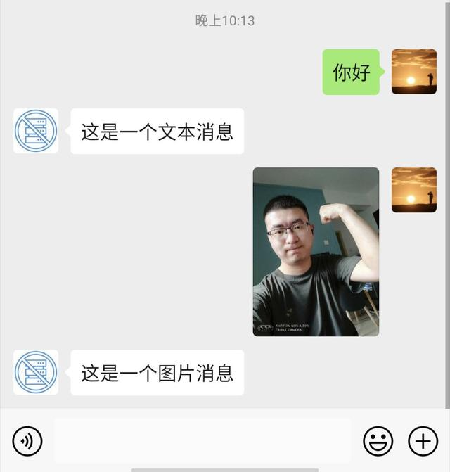

可以看到，系统已经可以正常返回。  
  
这样一个简单的小框架或者小Demo的意义是什么呢？

  

  * 可以告诉大家，我们可以很轻量的，通过一个函数来实现微信公众号的后端服务；

  * 这里都是基础能力，我们可以在这个基础能力基础上，“肆无忌惮”的添加创新力，例如：

    1. 用户传过来的是图片消息，我们可以通过一些识图API告诉用户这个图片包括了什么（接下来的文章分享中会涉及这部分内容）

    2. 用户传过来的是文字消息，我们可以先设定一些帮助信息/检索信息进行对比，如果没找到就给用户开启聊天功能（这里涉及到人工智能中的自然语言处理，例如对话、文本相似度检测，之后分享也会和大家举例说明）

    3. 如果用户发送到是语音我们还可以将其转成文本，生成对话消息，然后再转换成语音返回给用户

    4. 如果用户发送了地理位置信息，我们可以返回给用户所在经纬度的街景信息或者周边的信息/生活服务信息等

    5. .........

这些能力都可以自行添加。  

### 使用Werobot框架
  

上面的方法，是通过Serverless原生开发的方法进行对接，除此之外，我们还可以选择一些已有的框架，例如`werobot`等。

以`werobot`为例:

WeRoBot 是一个微信公众号开发框架。通过Serverless Component中的`tencent-werobot`组件快速部署该框架： 

```yaml
Weixin_Werobot:
  component: "@serverless/tencent-werobot"
  inputs:
    functionName: Weixin_Werobot
    code: ./test
    werobotProjectName: app
    werobotAttrName: robot
    functionConf:
      timeout: 10
      memorySize: 256
      environment:
        variables:
          wxtoken: 你的token
      apigatewayConf:
        protocols:
          - http
        environment: release
```

然后新建代码：  

```python
import os
import werobot

robot = werobot.WeRoBot(token=os.environ.get('wxtoken'))

robot.config['SESSION_STORAGE'] = False
robot.config["APP_ID"] = os.environ.get('appid')
robot.config["APP_SECRET"] = os.environ.get('secret')

# @robot.handler 处理所有消息
@robot.handler
def hello(message):
    return 'Hello World!'

if __name__ == "__main__":
    # 让服务器监听在 0.0.0.0:80
    robot.config['HOST'] = '0.0.0.0'
    robot.config['PORT'] = 80
    robot.run()


```

并且在本地安装werobot相关依赖，完成之后，执行部署：


并把下面的这个地址复制到公众号后台：


开启调用即可。参考Git：https://github.com/serverless-tencent/tencent-werobot  
这里需要注意的是，我们一定要关掉Session或者将Session改成云数据库，不能使用本地文件等，例如关闭Session配置：

```python
robot.config['SESSION_STORAGE'] = False
```

## 文本相似度实现图文检索

首先要说为什么要做文章搜索功能？

因为用户，不知道我们发了什么文章，也不清楚每个文章具体内容，他可能只需要简单的关键词，来看一下这个公众号是否有他想要的东西，例如他搜索：如何上传文件？或者搜索：如何开发Component？这样简单的问题，就可以快速把最相关的历史文章推送给用户，这将会是很方便的一件事情。先将效果图分享一下：

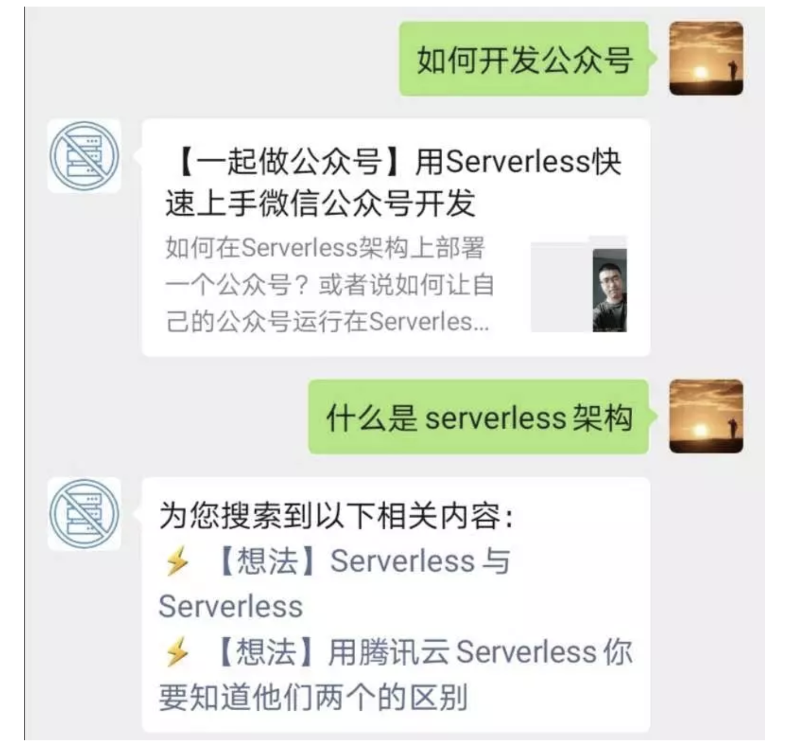

是的，通过这样简单的问题描述，找到目标结果，表面上这是一个文章搜索功能，实际上可以把它拓展成是一种“客服系统”。甚至将其升级为一种“聊天系统”，当然这些都是后话。

在之前的代码基础上，我们新增两个函数：

* 函数1: 索引建立函数

主要功能：通过触发该函数，可以将现有的公众号数据进行整理，并且建立适当的索引文件，存储到COS中。

```python

# -*- coding: utf8 -*-
import os
import re
import json
import random
from snownlp import SnowNLP
from qcloud_cos_v5 import CosConfig
from qcloud_cos_v5 import CosS3Client

bucket = os.environ.get('bucket')
secret_id = os.environ.get('secret_id')
secret_key = os.environ.get('secret_key')
region = os.environ.get('region')
client = CosS3Client(CosConfig(Region=region, SecretId=secret_id, SecretKey=secret_key))


def main_handler(event, context):
    response = client.get_object(
        Bucket=bucket,
        Key=event["key"],
    )
    response['Body'].get_stream_to_file('/tmp/output.txt')

    with open('/tmp/output.txt') as f:
        data = json.loads(f.read())

    articlesIndex = []
    articles = {}
    tempContentList = [
        "_", "&nbsp;",
    ]
    for eveItem in data:
        for i in range(0, len(eveItem['content']['news_item'])):
            content = eveItem['content']['news_item'][i]['content']
            content = re.sub(r'<code(.*?)</code>', '_', content)
            content = re.sub(r'<.*?>', '', content)
            for eve in tempContentList:
                content = content.replace(eve, "")
            desc = "%s。%s。%s" % (
                eveItem['content']['news_item'][i]['title'],
                eveItem['content']['news_item'][i]['digest'],
                "。".join(SnowNLP(content).summary(3))
            )
            tempKey = "".join(random.sample('zyxwvutsrqponmlkjihgfedcba', 5))
            articlesIndex.append(
                {
                    "media_id": tempKey,
                    "description": desc
                }
            )
            articles[tempKey] = eveItem['content']['news_item'][i]

    client.put_object(
        Bucket=bucket,
        Body=json.dumps(articlesIndex).encode("utf-8"),
        Key=event['index_key'],
        EnableMD5=False
    )
    client.put_object(
        Bucket=bucket,
        Body=json.dumps(articles).encode("utf-8"),
        Key=event['key'],
        EnableMD5=False
    )
```

这一部分，可能定制化比较多一些，首先是tempContentList变量，这里可以写上一些我们公众号中可能出现且不重要的话，例如在公众号开始结尾可能有欢迎关注的文案，这些文案理论上不应该参与搜索，所以最好将他们在建立索引的时候进行替换去除。然后我们还通过上述代码去掉了code标签里面的内容，因为代码也会影响结果，同时我还去掉了html标签。

原始的文件大概是这样的：

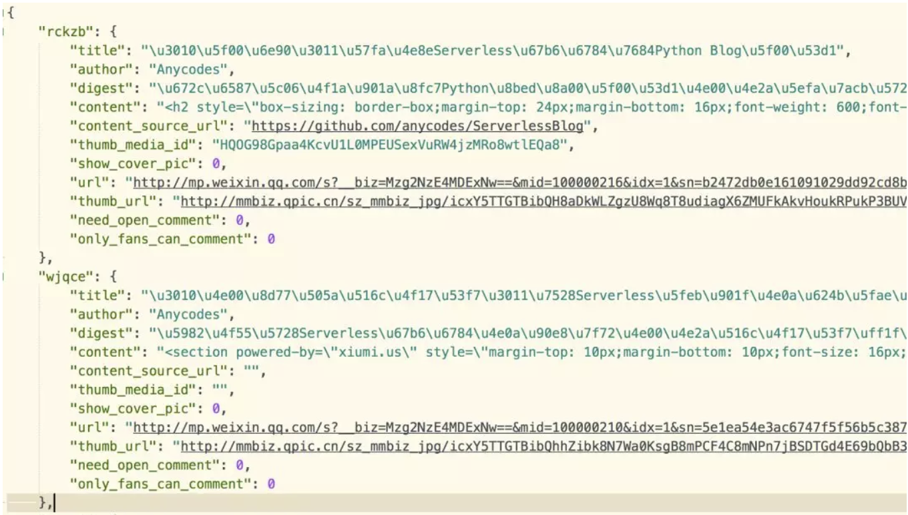

处理好的文件（通过标题+描述+SnowNLP提取的摘要）：

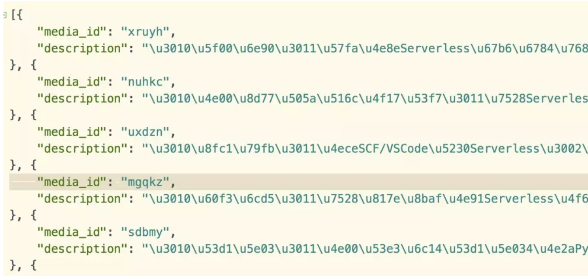

然后这些文件存储到COS中。这一部分的核心就是，正确让我们提取出来的description尽可能的可以准确的描述文章的内容。一般情况下，标题就是文章的核心，但是标题可能有一些信息丢失，例如说文章：【想法】用腾讯云Serverless你要知道他们两个的区别实际上描述的是Plugin和Component的区别，虽然标题知道是两个东西，但是却缺少了核心的目标，所以再加上我们下面的描述：什么是Serverless Framework Plugin？什么是Component？Plugin与Component有什么区别？想要入门Serverless CLI，这两个产品必须分的清楚，本文将会分享这二者区别与对应的特点、功能。当然，加上描述之后内容变得已经相当精确，但是正文中，可能有相对来说更加精准的描述或者额外的内容，所以采用的是标题+描述+摘要（textRank提取出来的前三句，属于提取式文本）。

* 函数2: 搜索函数

主要功能：当用户向微信号发送了指定关键词，通过该函数获取的结果。

思考：函数1和函数2，都可以集成在之前的函数中，为什么要把函数1和函数2单独拿出来做一个独立的函数存在呢？放在一个函数中不好么？

是这样的，主函数触发次数相对来说是最多的，而且这个函数本身不需要太多的资源配置（64M就够了），而函数1和函数2，可能需要消耗更多的资源，如果三个函数合并放在一起，可能函数的内存大小需要整体调大，满足三个函数需求，这样的话，相对来说会消耗更多资源，例如
主函数触发了10次（64M，每次1S），函数1触发了2次（512M，每次5S），函数2触发了4次（384M，每次3S）

如果将三个函数放在一起，资源消耗是：


如果将其变成三个函数来执行，资源消耗是：

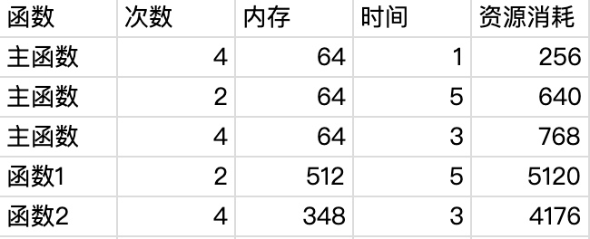

前者总计资源消耗13308，后者10432，随着调用次数越来越多，主函数的调用比例会越来越大，所以节约的资源也就会越来越多，所以此处建议将资源消耗差距比较大的模块，分成不同函数进行部署。

```python
import os
import json
import jieba
from qcloud_cos_v5 import CosConfig
from qcloud_cos_v5 import CosS3Client
from collections import defaultdict
from gensim import corpora, models, similarities

bucket = os.environ.get('bucket')
secret_id = os.environ.get('secret_id')
secret_key = os.environ.get('secret_key')
region = os.environ.get('region')
client = CosS3Client(CosConfig(Region=region, SecretId=secret_id, SecretKey=secret_key))


def main_handler(event, context):
    response = client.get_object(
        Bucket=bucket,
        Key=event["key"],
    )
    response['Body'].get_stream_to_file('/tmp/output.txt')

    with open('/tmp/output.txt') as f:
        data = json.loads(f.read())

    articles = []
    articlesDict = {}
    for eve in data:
        articles.append(eve['description'])
        articlesDict[eve['description']] = eve['media_id']

    sentence = event["sentence"]

    documents = []
    for eve_sentence in articles:
        tempData = " ".join(jieba.cut(eve_sentence))
        documents.append(tempData)
    texts = [[word for word in document.split()] for document in documents]
    frequency = defaultdict(int)
    for text in texts:
        for word in text:
            frequency[word] += 1
    dictionary = corpora.Dictionary(texts)
    new_xs = dictionary.doc2bow(jieba.cut(sentence))
    corpus = [dictionary.doc2bow(text) for text in texts]
    tfidf = models.TfidfModel(corpus)
    featurenum = len(dictionary.token2id.keys())
    sim = similarities.SparseMatrixSimilarity(
        tfidf[corpus],
        num_features=featurenum
    )[tfidf[new_xs]]
    answer_list = [(sim[i], articles[i]) for i in range(1, len(articles))]
    answer_list.sort(key=lambda x: x[0], reverse=True)
    result = []
    print(answer_list)
    for eve in answer_list:
        if eve[0] > 0.10:
            result.append(articlesDict[eve[1]])
    if len(result) >= 8:
        result = result[0:8]
    return {"result": json.dumps(result)}

```

这一部分的代码也是很简单，主要是通过文本的相似度对每个文本进行评分，然后按照评分从高到低进行排序，给定一个阈值（此处设定的阈值为0.1），输出阈值之前的数据。

另外这里要注意，此处引用了两个依赖是jieba和gensim，这两个依赖都可能涉及到二进制文件，所以强烈推荐在CentOS系统下进行打包。

接下来就是主函数中的调用，为了实现上述功能，需要在主函数中新增方法：

1: 获取全部图文消息

```python
def getTheTotalOfAllMaterials():
    '''
    文档地址：https://developers.weixin.qq.com/doc/offiaccount/Asset_Management/Get_the_total_of_all_materials.html
    :return:
    '''
    accessToken = getAccessToken()
    if not accessToken:
        return "Get Access Token Error"
    url = "https://api.weixin.qq.com/cgi-bin/material/get_materialcount?access_token=%s" % accessToken
    responseAttr = urllib.request.urlopen(url=url)
    return json.loads(responseAttr.read())


def getMaterialsList(listType, count):
    '''
    文档地址：https://developers.weixin.qq.com/doc/offiaccount/Asset_Management/Get_materials_list.html
    :return:
    '''
    accessToken = getAccessToken()
    if not accessToken:
        return "Get Access Token Error"

    url = "https://api.weixin.qq.com/cgi-bin/material/batchget_material?access_token=%s" % accessToken
    materialsList = []
    for i in range(1, int(count / 20) + 2):
        requestAttr = urllib.request.Request(url=url, data=json.dumps({
            "type": listType,
            "offset": 20 * (i - 1),
            "count": 20
        }).encode("utf-8"), headers={
            "Content-Type": "application/json"
        })
        responseAttr = urllib.request.urlopen(requestAttr)
        responseData = json.loads(responseAttr.read().decode("utf-8"))
        materialsList = materialsList + responseData["item"]
    return materialsList
```

可以通过以下代码调用：

```python
rticlesList = getMaterialsList("news", getTheTotalOfAllMaterials()['news_count'])
```

2: 将图文消息存储到COS，并且通过函数的Invoke接口，实现函数间调用：

```python
def saveNewsToCos():
    global articlesList
    articlesList = getMaterialsList("news", getTheTotalOfAllMaterials()['news_count'])
    try:
        cosClient.put_object(
            Bucket=bucket,
            Body=json.dumps(articlesList).encode("utf-8"),
            Key=key,
            EnableMD5=False
        )
        req = models.InvokeRequest()
        params = '{"FunctionName":"Weixin_GoServerless_GetIndexFile", "ClientContext":"{\\"key\\": \\"%s\\", \\"index_key\\": \\"%s\\"}"}' % (
            key, indexKey)
        req.from_json_string(params)
        resp = scfClient.Invoke(req)
        resp.to_json_string()
        response = cosClient.get_object(
            Bucket=bucket,
            Key=key,
        )
        response['Body'].get_stream_to_file('/tmp/content.json')
        with open('/tmp/content.json') as f:
            articlesList = json.loads(f.read())
        return True
    except Exception as e:
        print(e)
        return False
```

3: 根据搜索反馈回来的Key实现文章内容的对应

```python
def searchNews(sentence):
    req = models.InvokeRequest()
    params = '{"FunctionName":"Weixin_GoServerless_SearchNews", "ClientContext":"{\\"sentence\\": \\"%s\\", \\"key\\": \\"%s\\"}"}' % (
        sentence, indexKey)
    req.from_json_string(params)
    resp = scfClient.Invoke(req)
    print(json.loads(json.loads(resp.to_json_string())['Result']["RetMsg"]))
    media_id = json.loads(json.loads(json.loads(resp.to_json_string())['Result']["RetMsg"])["result"])
    return media_id if media_id else None
```

最后在main_handler中，增加使用逻辑：

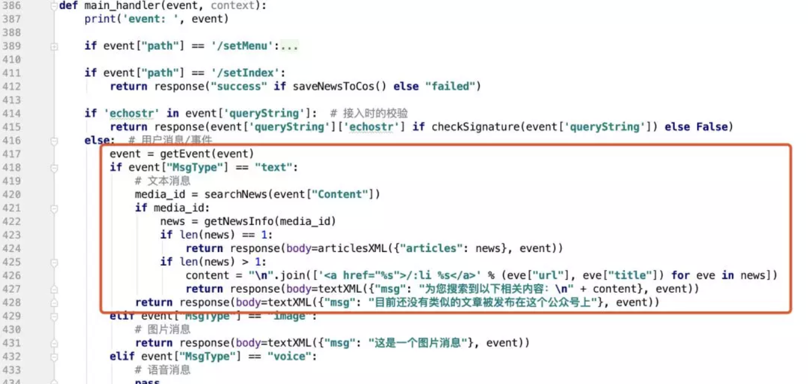

逻辑很简答，就是根据用户发的消息，去查找对应的结果，拿到结果之后判断结果个数，如果有1个相似内容，则返回一个图文，如果有多个则返回带有链接的文本。

另外一个逻辑是建立索引，直接是通过API网关触发即可，当然，如果怕不安全或者有需要的话，可以增加权限坚定的参数：


额外优化：

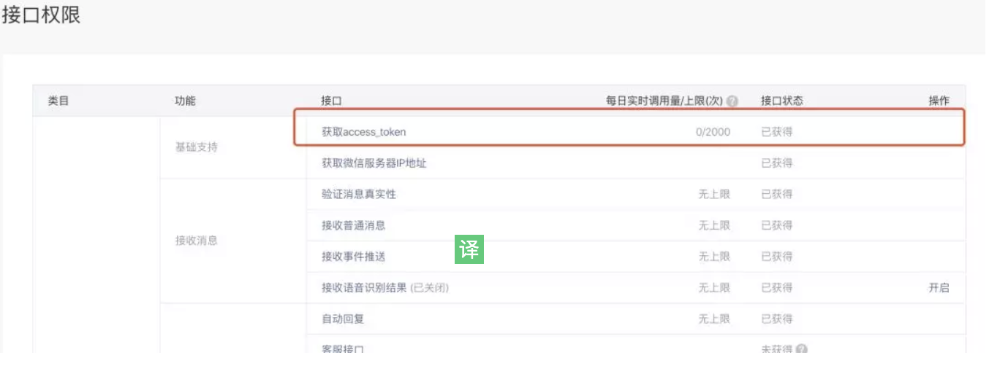

在接口列表中，我们可以看到获取accessToken的接口实际上是有次数限制的，每次获取有效期两个小时。所以，我们就要在函数中，对这部分内容做持久化。为了这个小东西，弄一个MySQL貌似不是很划算，所以决定用COS：

```python
def getAccessToken():
    '''
    文档地址：https://developers.weixin.qq.com/doc/offiaccount/Basic_Information/Get_access_token.html
    正常返回：{"access_token":"ACCESS_TOKEN","expires_in":7200}
    异常返回：{"errcode":40013,"errmsg":"invalid appid"}
    :return:
    '''
    global accessToken

    # 第一次判断是判断本地是否已经有了accessToken，考虑到容器复用情况
    if accessToken:
        if int(time.time()) - int(accessToken["time"]) <= 7000:
            return accessToken["access_token"]

    # 如果本地没有accessToken，可以去cos获取
    try:
        response = cosClient.get_object(
            Bucket=bucket,
            Key=accessTokenKey,
        )
        response['Body'].get_stream_to_file('/tmp/token.json')
        with open('/tmp/token.json') as f:
            accessToken = json.loads(f.read())
    except:
        pass

    # 这一次是看cos中是否有，如果cos中有的话，再次进行判断段
    if accessToken:
        if int(time.time()) - int(accessToken["time"]) <= 7000:
            return accessToken["access_token"]

    # 如果此时流程还没停止，则说明accessToken还没获得到，就需要从接口获得，并且同步给cos
    url = "https://api.weixin.qq.com/cgi-bin/token?grant_type=client_credential&appid=%s&secret=%s" % (appid, secret)
    accessTokenResult = json.loads(urllib.request.urlopen(url).read().decode("utf-8"))
    accessToken = {"time": int(time.time()), "access_token": accessTokenResult["access_token"]}
    print(accessToken)
    response = cosClient.put_object(
        Bucket=bucket,
        Body=json.dumps(accessToken).encode("utf-8"),
        Key=accessTokenKey,
        EnableMD5=False
    )
    return None if "errcode" in accessToken else accessToken["access_token"]
```

当然，我觉得这段代码可以继续优化，但是目前这个算是一个思路。

## 为公众号增加机器人功能

上文我们已经完成了公众号的基本框架的搭建，也完成了基于NLP知识的图文检索功能，可以说之前的内容都是原生开发，无论是公众号基础能力建设还是图文检索能力，而这一部分将会在之前的基础上，通过云服务商为我们提供的AI能力，将智能聊天功能接入其中。

首先假设一个场景：用户关注这个公众号之后，他给公众号发送文本消息，我们首先进行图文检索，如果没找到合适的结果，我们就默认进入“聊天功能”；如果用户发送了语音，我们同样先进行图文检索，如果没有找得到相似图文，则通过语音进入“聊天功能”，这样看来是不是整个功能变得非常有趣？

首先整体看一下机器人功能的基本形态：

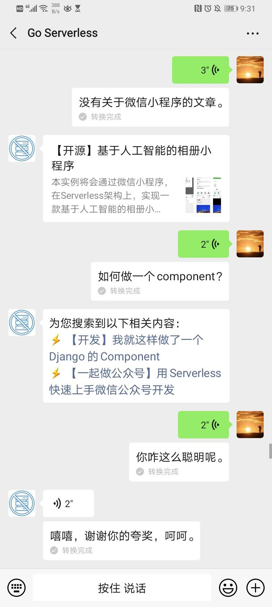


### 聊天功能增加

聊天功能我们可以借助云厂商提供的聊天机器人服务：


开通和使用这个服务，可以为我们创建一个简单的机器人：


创建完成机器人，我们可以通过云API对其进行代码的编写，云API代码比较难写也不怕，有API Explorer：


系统会为我们自动编写好基本的代码，我们只需要稍加修改，就可以复制到项目中：

在最外层进行相关初始化：

```python
tbpClient = tbp_client.TbpClient(credential.Credential(secret_id, secret_key), region)
```

初始化完成，增加聊天机器人函数：

```python
def chatBot(user, content):
    '''
    开发文档：https://cloud.tencent.com/document/product/1060/37438
    :param user: 用户id
    :param content: 聊天内容
    :return: 返回机器人说的话，如果出现故障返回None
    '''
    try:
        req = tbp_models.TextProcessRequest()
        params = '{"BotId":"%s","BotEnv":"release","TerminalId":"%s","InputText":"%s"}' % (
            bot_id, user, content
        )
        req.from_json_string(params)
        resp = tbpClient.TextProcess(req)
        return json.loads(resp.to_json_string())['ResponseMessage']['GroupList'][0]['Content']
    except Exception as e:
        print(e)
        return None
```

### 文本转音频功能增加

同样的方法，这不过是使用的另一个产品：


同样通过Explorer编写代码，然后初始化：

```python
ttsClient = tts_client.TtsClient(credential.Credential(secret_id, secret_key), region)
```

增加相关的方法实现文本到函数的转换：

```python
def text2Voice(text):
    '''
    文档地址：https://cloud.tencent.com/document/product/1073/37995
    :param text: 带转换的文本
    :return: 返回转换后的文件地址
    '''
    try:
        req = tts_models.TextToVoiceRequest()
        params = '{"Text":"%s","SessionId":"%s","ModelType":1,"VoiceType":1002}' % (
            text, "".join(random.sample('zyxwvutsrqponmlkjihgfedcba', 7)))
        req.from_json_string(params)
        resp = ttsClient.TextToVoice(req)
        file = '/tmp/' + "".join(random.sample('zyxwvutsrqponmlkjihgfedcba', 7)) + ".wav"
        with open(file, 'wb') as f:
            f.write(base64.b64decode(json.loads(resp.to_json_string())["Audio"]))
        return file

    except Exception as e:
        print(e)
        return None
```

### 增加微信的素材相关逻辑

由于我的账号是未认证的订阅号，所以可以使用的功能有限。在这里我需要先将生成的语音素材上传到公众号后台作为永久素材。因为语音类素材最大量为1000个，所以我还要顺便删除多余的素材。

此处我的做法很简单，先上传素材，然后获得素材总数，接下来根据素材中的时间戳：

```json
{
	'media_id': 'HQOG98Gpaa4KcvU1L0MPEW4Zvngs4kBqOyTRzNWBNME', 
	'name': 'ljpmybc.wav',
	'update_time': 1582896372, 
	'tags': []
}
```

就是`update_time`这个参数，和现在的时间进行判断，超过60S则认为这个素材已经过期，就可以删除，这样保证我们的素材数量不会溢出：

增加永久素材：

```python
def addingOtherPermanentAssets(file, fileType):
    '''
    文档地址：https://developers.weixin.qq.com/doc/offiaccount/Asset_Management/Adding_Permanent_Assets.html
    返回结果：{
                "media_id":"HQOG98Gpaa4KcvU1L0MPEcyy31LSuHhRi8gD3pvebhI",
                "url":"http:\/\/mmbiz.qpic.cn\/sz_mmbiz_png\/icxY5TTGTBibSyZPfLAEZmeaicUczsoGUpqLgBlRbNxeic4R8r94j60BiaxDLEZTAK7I7qubG3Ik808P8jYLdFJTcOA\/0?wx_fmt=png",
                "item":[]
            }
    :param file:
    :return:
    '''
    typeDict = {
        "voice": "wav"
    }
    url = "https://api.weixin.qq.com/cgi-bin/material/add_material?access_token=%s&type=%s" % (
        getAccessToken(), fileType)
    boundary = '----WebKitFormBoundary7MA4YWxk%s' % "".join(random.sample('zyxwvutsrqponmlkjihgfedcba', 7))
    with open(file, 'rb') as f:
        fileData = f.read()
    data = {'media': (os.path.split(file)[1], fileData, typeDict[fileType])}
    headers = {
        "Content-Type": "multipart/form-data; boundary=%s" % boundary,
        "User-Agent": "okhttp/3.10.0"
    }
    reqAttr = urllib.request.Request(url=url,
                                     data=encode_multipart_formdata(data, boundary=boundary)[0],
                                     headers=headers)
    responseData = json.loads(urllib.request.urlopen(reqAttr).read().decode("utf-8"))

    try:
        for eveVoice in getMaterialsList("voice", getTheTotalOfAllMaterials()['voice_count']):
            try:
                if int(time.time()) - int(eveVoice["update_time"]) > 60:
                    deletingPermanentAssets(eveVoice['media_id'])
            except:
                pass
    except:
        pass

    return responseData['media_id'] if "media_id" in responseData else None
```

删除素材：

```python
def deletingPermanentAssets(media_id):
    '''
    文档地址：https://developers.weixin.qq.com/doc/offiaccount/Asset_Management/Deleting_Permanent_Assets.html
    :return:
    '''
    url = 'https://api.weixin.qq.com/cgi-bin/material/del_material?access_token=%s' % (getAccessToken())
    data = {
        "media_id": media_id
    }
    postData = json.dumps(data).encode("utf-8")
    reqAttr = urllib.request.Request(url=url, data=postData)
    print(urllib.request.urlopen(reqAttr).read())
```

至此，基础代码已经完成，剩下的逻辑就是在main_handler中进行组合：

文本消息部分的组合逻辑：

```python
media_id = searchNews(event["Content"])
result = getNewsResult(media_id, event)
if not result:
	chatBotResponse = chatBot(event["FromUserName"], event["Content"])
	result = textXML({"msg": chatBotResponse if chatBotResponse else "目前还没有类似的文章被发布在这个公众号上"}, event)
	return response(body=result)
```

语音消息部分组合逻辑：

```python
media_id = searchNews(event["Recognition"])
result = getNewsResult(media_id, event)
if not result:
    chatBotResponse = chatBot(event["FromUserName"], event["Recognition"])
    if chatBotResponse:
        voiceFile = text2Voice(chatBotResponse)
        if voiceFile:
            uploadResult = addingOtherPermanentAssets(voiceFile, 'voice')
            if uploadResult:
                result = voiceXML({"media_id": uploadResult}, event)
if not result:
    result = textXML({"msg": "目前还没有类似的文章被发布在这个公众号上"}, event)
return response(body=result)
```

## 总结

至此，我们完成了一个简单的公众号开发。通过Serverless的原生开发思路（也可以使用Werobot等公众号开发框架），将我们的公众号后台服务部署到Serverless架构上，通过自然语言处理技术（特指文本相似度等）实现了一个图文检索功能；通过与云厂商提供的AI能力结合，实现了一个聊天机器人，可以和我们文本交流，也可以进行语音沟通。

Serverless架构在开发微信公众号这种事件驱动类的触发式场景有着很大的优势，本文仅仅是抛砖引玉，更多的功能，更多的应用，更多的能力和价值，还是要看具体业务，希望读者可以通过本文，对Serverless架构有更深入的了解。