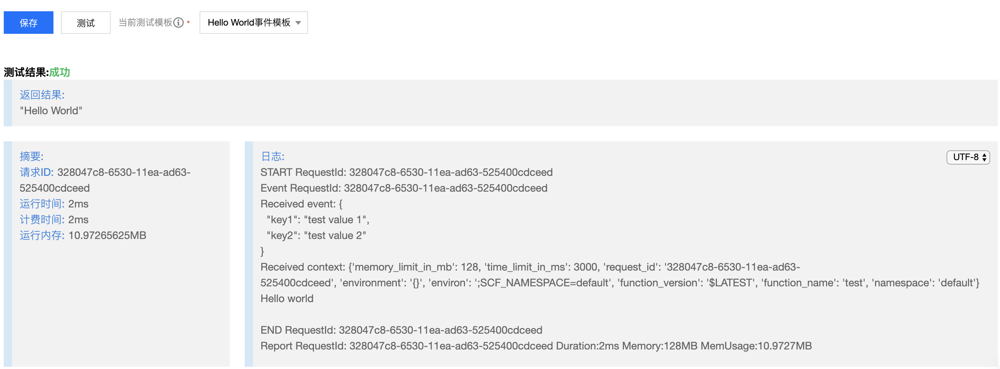
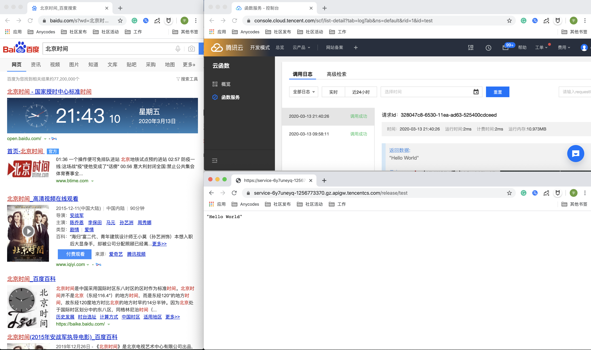
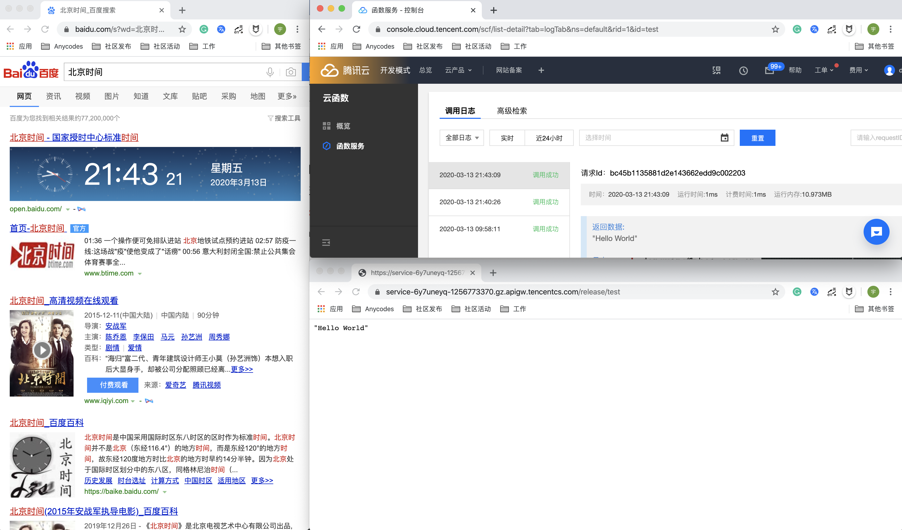
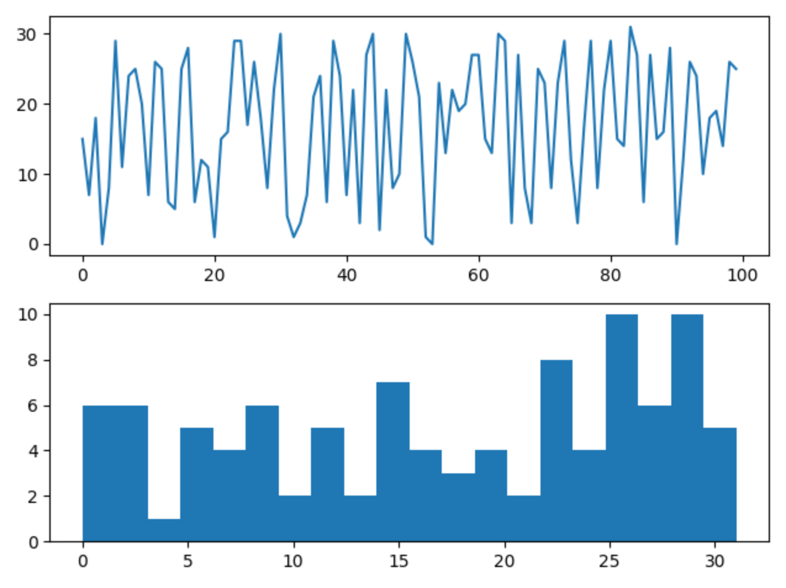
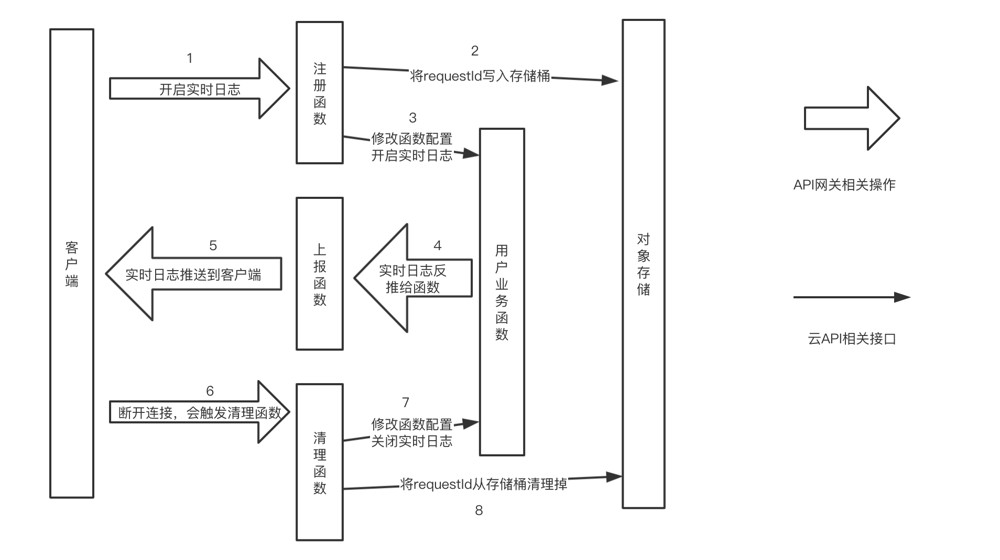

# 第五篇：Serverless架构下如何进行调试与日志的实时输出

## 前言

在Serverless白皮书中，描述过一段话，大概是说Serverless有一些缺点，例如难于调试，冷启动严重。这其中的难于调试，表现在很多方面，其中一个方面就是日志输出问题。

在实际生产生活中，我们在正真正将Serverless架构应用于实际项目过程中，会发现：调试是影响我们效率的一大障碍。以其中的日志输出为例，我们的某个函数被触发之后，未得到预期结果，这个时候，想必大家第一想法就是查看一下日志；然而这个日志的输出，可能未必是我们想要的：在很多云厂商这里，日志的输出延时是蛮高的！

## 日志输出现状

这里仅仅以腾讯云云函数为例，我们可以看一下其日志输出情况：

* 当我们有一个云函数，我们通过控制台触发（或者是云API的Invoke接口）：



我们可以看到，通过这个`测试`功能，我们很快将函数的结果获取到，并且看到了日志信息。

* 当我们有一个函数，我们通过API网关触发、COS触发等，此处以API网关为例：

我们先通过网关触发一个函数：



我们再通过这个函数的日志看看什么时候会刷出这个日志：



这个过程大概有11S，我们可以通过代码来进行更加详细的测试：

```python
import json,time
from tencentcloud.common import credential
from tencentcloud.common.profile.client_profile import ClientProfile
from tencentcloud.common.profile.http_profile import HttpProfile
from tencentcloud.common.exception.tencent_cloud_sdk_exception import TencentCloudSDKException
from tencentcloud.scf.v20180416 import scf_client, models
try:
    cred = credential.Credential("", "")
    httpProfile = HttpProfile()
    httpProfile.endpoint = "scf.tencentcloudapi.com"

    clientProfile = ClientProfile()
    clientProfile.httpProfile = httpProfile
    client = scf_client.ScfClient(cred, "ap-guangzhou", clientProfile)

    req = models.InvokeRequest()
    params = '{"FunctionName":"test"}'
    req.from_json_string(params)

    resp = client.Invoke(req)
    functionRequestId = json.loads(resp.to_json_string())["Result"][ "FunctionRequestId"]

    print(time.time(), functionRequestId)

    while True:
        time.sleep(0.2)
        req = models.GetFunctionLogsRequest()
        params = '{"FunctionName":"test"}'
        req.from_json_string(params)

        resp = client.GetFunctionLogs(req)
        if functionRequestId in str(resp.to_json_string()):
            break

    print(time.time())


except TencentCloudSDKException as err:
    print(err)

```

输出结果：
```text
1584108001.141546 ee7243dd-6532-11ea-8bce-5254000c8aa4
1584108005.2496068
```

可以看到，这次输出结果是4S，我们不妨做一个多次调用的时间对比图：

```python
import json
import time
import numpy
import matplotlib.pyplot as plt
from tencentcloud.common import credential
from tencentcloud.common.profile.client_profile import ClientProfile
from tencentcloud.common.profile.http_profile import HttpProfile
from tencentcloud.common.exception.tencent_cloud_sdk_exception import TencentCloudSDKException
from tencentcloud.scf.v20180416 import scf_client, models

try:
    cred = credential.Credential("", "")
    httpProfile = HttpProfile()
    httpProfile.endpoint = "scf.tencentcloudapi.com"

    clientProfile = ClientProfile()
    clientProfile.httpProfile = httpProfile
    client = scf_client.ScfClient(cred, "ap-guangzhou", clientProfile)

    timeList = []
    for i in range(0, 100):
        req = models.InvokeRequest()
        params = '{"FunctionName":"test"}'
        req.from_json_string(params)

        resp = client.Invoke(req)
        functionRequestId = json.loads(resp.to_json_string())["Result"]["FunctionRequestId"]

        startTime = int(time.time())

        while True:
            time.sleep(0.2)
            req = models.GetFunctionLogsRequest()
            params = '{"FunctionName":"test"}'
            req.from_json_string(params)

            resp = client.GetFunctionLogs(req)
            if functionRequestId in str(resp.to_json_string()):
                break

        endTime = int(time.time())
        timeList.append(endTime - startTime)

    print("最大时间", int(max(timeList)))
    print("最小时间", int(min(timeList)))
    print("平均时间", int(numpy.mean(timeList)))

    plt.figure()
    plt.subplot(2, 1, 1)
    x_data = range(0, len(timeList))
    plt.plot(x_data, timeList)
    plt.subplot(2, 1, 2)
    plt.hist(timeList, bins=20)
    plt.show()


except TencentCloudSDKException as err:
    print(err)

```

比较差的一段代码，会耗时很久，可以考虑加入队列，一方面多进程在队列面加入执行的RequestId，一方面消费RequestId，进入到获取Logs的对象中，这样速度可以大大提升。但是无论如何，运行结果如下：

```text
最大时间 31
最小时间 0
平均时间 17
```




通过这个结果，我们可以看到，我们的日志出现的速度有两个问题：

* 时间频率不固定，通过数据可以考到，快的话可能几秒就出结果，慢的话可能十几秒，二十几秒，甚至三十几秒；
* 日志普遍输出速度很慢，会严重影响我们定位问题；

就目前的腾讯云Serverless架构而言，我们如果在本地开发完一个项目，在本地进行了初步的调试，就算一切正常，但是也并不能保证在线上完全可用，尤其在复杂的触发器环境下以及复杂的对象复用、内网资源使用的前提下，本地调试的难度非常大，很难完整的模拟出线上的环境。

以API网关触发器为例，当我们在本地写完代码，调试完成部署线上，通过API网关触发一次，发现函数代码不能正常运行，这个时候我们的第一个想法是什么？查看日志，看一下我们打印的日志有哪些问题，是不是通过日志可以判断出问题，那么这个时候很遗憾的告诉你，你可能要等几秒钟，十几秒钟，甚至二十几秒，三十秒，作为一个开发者定位问题，心里是什么样子的一个状态？

## 自建日志输出功能

通过刚才的分析，我们可以知道，当我们在线上触发函数的时候，日志入库的速度非常缓慢，而且极其不稳定，在一定条件下，会严重影响我们的开发进度以及问题定位的进度，根据这个问题，我们可以通过Serverless架构，封装一套实时日志功能：



在这个操作过程中，主要使用一个API网关作为Websocket与客户端建立链接，三个函数（注册函数，上报函数，清理函数）与API搭配使用，存储桶作为部分资源的临时存储。

整个流程大概可以描述为：
1. 客户端决定开启实时日志，并将要监控的函数信息（包括地域，命名空间，函数名）作为参数，与API网关建立Websocket链接；
2. API网关建立Websocket链接的时候，会触发注册函数，此时注册函数会讲将RequestId（ConnectionId）与函数信息以Key-Value存储到对象存储中；
3. 更具函数信息，找到对应的函数，将回推地址以及ConnectionId写到函数环境变量中；
4. 此时函数只要被触发，就会先读取环境变量，根据环境变量决定是否将函数日志上报到指定地址（即带着connectionId发送到回推地址）；
5. 上报函数收到业务函数传递过来的数据，将数据发送到指定的ConnectionId的客户端，实现实时日志的输出；
6. 当客户端断开连接之后，会触发清理函数；
7. 清理函数会清理掉业务函数中的回推地址和ConnectionId等信息，清理之后，业务函数再被触发，则因为读取不到该参数，而不会上报数据；
8. 将根据RequestId（ConnectionId）从对象存储删除，至此完成一次日志实时输出功能；

由于腾讯云的API网关限制，所以该功能每次最长只能执行900s，900s之后需要重新执行该程序。

API网关涉及到的三个函数：

* 注册函数：主要用来完成数据存储和函数信息修改等操作，是用户建立链接时触发的函数；
```python
# -*- coding: utf8 -*-

import json, os
from qcloud_cos_v5 import CosConfig
from qcloud_cos_v5 import CosS3Client
from tencentcloud.common import credential
from tencentcloud.scf.v20180416 import scf_client, models


def setFunction2Bucket(name, namespace, secretId, secretKey, token, connid):
    region = os.environ.get("bucket_region")
    config = CosConfig(Region=region, SecretId=secretId, SecretKey=secretKey, Token=token)
    client = CosS3Client(config)
    response = client.put_object(
        Bucket=os.environ.get("bucket"),
        Body=json.dumps({
            "region": region,
            "namespace": namespace,
            "function": name
        }).encode("utf-8"),
        Key=connid,
        EnableMD5=False
    )
    return response


def setFunctionConfigure(name, namespace, region, secreetId, secretKey, token, connid, transurl):
    try:
        environmentVariablesList = [
            {
                "Key": "real_time_log_id",
                "Value": connid
            },
            {
                "Key": "real_time_log_url",
                "Value": transurl
            },
            {
                "Key": "real_time_log",
                "Value": "open"
            }
        ]
        cred = credential.Credential(secreetId, secretKey, token=token)
        client = scf_client.ScfClient(cred, region)

        req = models.GetFunctionRequest()
        req.from_json_string(json.dumps({"FunctionName": name, "Namespace": namespace, "ShowCode": "FALSE"}))
        resp = client.GetFunction(req)
        environmentVariables = json.loads(resp.to_json_string())["Environment"]["Variables"]
        for eveVariables in environmentVariables:
            if eveVariables["Key"] == "real_time_log_id" or eveVariables["Key"] == "real_time_log_url" or eveVariables["Key"] == "real_time_log":
                continue
            environmentVariablesList.append(eveVariables)

        req = models.UpdateFunctionConfigurationRequest()
        req.from_json_string(json.dumps({"FunctionName": name,
                                         "Environment": {
                                             "Variables": environmentVariablesList
                                         },
                                         "Namespace": namespace}))
        client.UpdateFunctionConfiguration(req)

        setFunction2Bucket(name, namespace, secreetId, secretKey, token, connid)
        return True
    except Exception as e:
        print(e)
        return False


def main_handler(event, context):
    print("event is: ", event)

    connectionID = event['websocket']['secConnectionID']
    if not setFunctionConfigure(
            event['queryString']['name'],
            event['queryString']['namespace'],
            event['queryString']['region'],
            os.environ.get("TENCENTCLOUD_SECRETID"),
            os.environ.get("TENCENTCLOUD_SECRETKEY"),
            os.environ.get("TENCENTCLOUD_SESSIONTOKEN"),
            connectionID,
            os.environ.get("url")
    ):
        return False

    if 'requestContext' not in event.keys():
        return {"errNo": 101, "errMsg": "not found request context"}
    if 'websocket' not in event.keys():
        return {"errNo": 102, "errMsg": "not found web socket"}

    retmsg = {}
    retmsg['errNo'] = 0
    retmsg['errMsg'] = "ok"
    retmsg['websocket'] = {
        "action": "connecting",
        "secConnectionID": connectionID
    }

    if "secWebSocketProtocol" in event['websocket'].keys():
        retmsg['websocket']['secWebSocketProtocol'] = event['websocket']['secWebSocketProtocol']
    if "secWebSocketExtensions" in event['websocket'].keys():
        ext = event['websocket']['secWebSocketExtensions']
        retext = []
        exts = ext.split(";")
        print(exts)
        for e in exts:
            e = e.strip(" ")
            if e == "permessage-deflate":
                pass
            if e == "client_max_window_bits":
                pass
        retmsg['websocket']['secWebSocketExtensions'] = ";".join(retext)

    print("connecting: connection id:%s" % event['websocket']['secConnectionID'])
    return retmsg

```

* 上报函数：是用户开启实时日志成功之后，业务函数上报数据的地点
```python
# -*- coding: utf8 -*-
import os
import json
import requests


def main_handler(event, context):
    try:
        print("event is: ", event)

        body = json.loads(event["body"])

        url = os.environ.get("url")

        retmsg = {}
        retmsg['websocket'] = {}
        retmsg['websocket']['action'] = "data send"
        retmsg['websocket']['secConnectionID'] = body["coid"]
        retmsg['websocket']['dataType'] = 'text'
        retmsg['websocket']['data'] = body["data"]
        print(retmsg)
        requests.post(url, json=retmsg)

        return True
    except Exception as e:
        return False

```

* 清理函数：是客户端关闭链接时触发的函数，部分操作是注册函数的逆操作
```python
# -*- coding: utf8 -*-

import json, os
import requests
from qcloud_cos_v5 import CosConfig
from qcloud_cos_v5 import CosS3Client
from tencentcloud.common import credential
from tencentcloud.scf.v20180416 import scf_client, models


def setFunctionConfigure(name, namespace, region, secreetId, secretKey, token):
    try:
        environmentVariablesList = [{
            "Key": "real_time_log",
            "Value": "close"
        }]
        cred = credential.Credential(secreetId, secretKey, token=token)
        client = scf_client.ScfClient(cred, region)

        req = models.GetFunctionRequest()
        params = json.dumps({"FunctionName": name, "Namespace": namespace, "ShowCode": "FALSE"})
        req.from_json_string(params)

        resp = client.GetFunction(req)
        environmentVariables = json.loads(resp.to_json_string())["Environment"]["Variables"]

        for eveVariables in environmentVariables:
            if eveVariables["Key"] == "real_time_log_id" or eveVariables["Key"] == "real_time_log_url" or eveVariables["Key"] == "real_time_log":
                continue
            environmentVariablesList.append(eveVariables)

        print(environmentVariablesList)
        req = models.UpdateFunctionConfigurationRequest()
        params = json.dumps({"FunctionName": name,
                             "Environment": {
                                 "Variables": environmentVariablesList
                             },
                             "Namespace": namespace})
        req.from_json_string(params)

        resp = client.UpdateFunctionConfiguration(req)
        print(resp.to_json_string())
        return True
    except Exception as e:
        print(e)
        return False


def main_handler(event, context):
    print("event is: ", event)

    connectionID = event['websocket']['secConnectionID']

    region = os.environ.get("bucket_region")
    secreetId = os.environ.get("TENCENTCLOUD_SECRETID")
    secretKey = os.environ.get("TENCENTCLOUD_SECRETKEY")
    token = os.environ.get("TENCENTCLOUD_SESSIONTOKEN")
    config = CosConfig(Region=region, SecretId=secreetId, SecretKey=secretKey, Token=token)
    client = CosS3Client(config)
    response = client.get_object(
        Bucket=os.environ.get("bucket"),
        Key=connectionID,
    )
    response['Body'].get_stream_to_file('/tmp/connid.json')
    with open('/tmp/connid.json') as f:
        data = json.loads(f.read())

    if not setFunctionConfigure(
            data["function"],
            data["namespace"],
            data["region"],
            secreetId,
            secretKey,
            token,
    ):
        return False

    retmsg = {}
    retmsg['websocket'] = {}
    retmsg['websocket']['action'] = "closing"
    retmsg['websocket']['secConnectionID'] = connectionID
    requests.post(os.environ.get("url"), json=retmsg)
    return retmsg

```

业务函数上报数据的逻辑，实际上就是修改常见组件的日志方法，以Python为例，例如重写`print()`方法以及`logging`组件：

重写`print()`：
```python
# -*- coding: utf8 -*-

import os
import sys
import json
import urllib.parse
import urllib.request


def print(*args):
    url = os.environ.get("real_time_log_url")
    cid = os.environ.get("real_time_log_id")
    if url and cid and os.environ.get("real_time_log_id", None):
        try:
            retmsg = {
                "coid": cid,
                "data": " ".join([str(eveObject) for eveObject in args])
            }
            urllib.request.urlopen(
                urllib.request.Request(
                    url=url,
                    data=json.dumps(retmsg).encode("utf-8")
                )
            )
        except Exception as e:
            sys.stdout.write("Debug Error:" + str(e))
    sys.stdout.write("aaa"+  " ".join([str(eveObject) for eveObject in args]) + "\n")
```

对`logging`进行额外的处理，将文件中的`log`/`info`...等接口增加上报逻辑，例如：
```python
def warning(msg, *args, **kwargs):
    """
    Log a message with severity 'WARNING' on the root logger. If the logger has
    no handlers, call basicConfig() to add a console handler with a pre-defined
    format.
    """
    realTimeLogs("WARNING %s %s"%(str(msg), " ".join([str(eveObject) for eveObject in args])))
    if len(root.handlers) == 0:
        basicConfig()
    root.warning(msg, *args, **kwargs)
```

上报逻辑：

```python
def realTimeLogs(data):
    url = os.environ.get("real_time_log_url")
    cid = os.environ.get("real_time_log_id")
    if url and cid and os.environ.get("real_time_log_id", None):
        try:
            retmsg = {
                "coid": cid,
                "data": data
            }
            urllib.request.urlopen(
                urllib.request.Request(
                    url=url,
                    data=json.dumps(retmsg).encode("utf-8")
                )
            )
        except Exception as e:
            sys.stdout.write("Debug Error:" + str(e))
```

## 封装成工具

* 将重写部分封装成客户端工具
* 将线上函数部分封装成Component

封装成工具后的整体使用流程：

### 组件的安装与配置

* 安装`scflog`：

```text
npm install scflog
```

* 部署实时日志组件，新建项目，并且建立`serverless.yaml`，内容：

```text
PythonLogs:
  component: '@gosls/tencent-pythonlogs'
  inputs:
    region: ap-guangzhou
```

通过`sls --debug`部署：

```text
DEBUG ─ Setting tags for function PythonRealTimeLogs_Cleanup
DEBUG ─ Creating trigger for function PythonRealTimeLogs_Cleanup
DEBUG ─ Deployed function PythonRealTimeLogs_Cleanup successful

PythonLogs: 
    websocket: ws://service-laabz6zm-1256773370.gz.apigw.tencentcs.com/test/python_real_time_logs
    
    26s › PythonLogs › done

```

此时我们需要配置组件：

```text
scflog set -w ws://service-laabz6zm-1256773370.gz.apigw.tencentcs.com/test/python_real_time_logs
```

配置成功输出：

```text
DFOUNDERLIU-MB0:~ dfounderliu$ scflog set -w ws://service-laabz6zm-1256773370.gz.apigw.tencentcs.com/test/python_real_time_logs
设置成功
	websocket: ws://service-laabz6zm-1256773370.gz.apigw.tencentcs.com/test/python_real_time_logs
	region: ap-guangzhou
	namespace: default
```

### 函数的初始化与部署

在项目中使用该组件的方法很简单。

* 创建一个文件夹，并进入

`mkdir scflogs && cd scflogs`

* 初始化项目

`scflog init -l python`

* 创建`index.py`文件以及`serverless.yaml`文件：

```text
vim index.py
```

内容是：

```text
from logs import *
import time
import logging

def main_handler(event, context):
    print("event is: ", event)
    time.sleep(1)
    logging.debug("this is debug_msg")
    time.sleep(1)
    logging.info("this is info_msg")
    time.sleep(1)
    logging.warning("this is warning_msg")
    time.sleep(1)
    logging.error("this is error_msg")
    time.sleep(1)
    logging.critical("this is critical_msg")
    time.sleep(1)
    print("context is: ", event)
    return "hello world"

```

```text
vim serverless.yaml
```

内容是：

```text
Hello_World:
  component: "@serverless/tencent-scf"
  inputs:
    name: Hello_World
    codeUri: ./
    handler: index.main_handler
    runtime: Python3.6
    region: ap-guangzhou
    description: My Serverless Function
    memorySize: 64
    timeout: 20
    exclude:
      - .gitignore
      - .git/**
      - node_modules/**
      - .serverless
      - .env
    events:
      - apigw:
          name: serverless
          parameters:
            protocols:
              - http
            serviceName: serverless
            description: the serverless service
            environment: release
            endpoints:
              - path: /test
                method: ANY

```

通过`sls --debug`部署：

```text
DEBUG ─ Deployed function Hello_World successful

  Hello_World: 
    Name:        Hello_World
    Runtime:     Python3.6
    Handler:     index.main_handler
    MemorySize:  64
    Timeout:     20
    Region:      ap-guangzhou
    Namespace:   default
    Description: My Serverless Function
    APIGateway: 
      - serverless - http://service-89bjzrye-1256773370.gz.apigw.tencentcs.com/release

  30s › Hello_World › done

```

### 实时日志功能的测试

此时，我们配置了APIGW的触发器，地址是上面输出的地址 + endpoints中的path例如：

```text
http://service-89bjzrye-1256773370.gz.apigw.tencentcs.com/release/test
```

此时，我们可以打开实时日志：

```text
scflog logs -n Hello_World -r ap-guangzhou
```

此时会提醒我们实时日志开启成功：

```text
DFOUNDERLIU-MB0:~ dfounderliu$ scflog logs -n Hello_World -r ap-guangzhou
实时日志开启 ... 
```

我们可以用浏览器通过刚才函数部署完成返回给我们的地址触发函数：

```text
实时日志开启 ... 
[2020-03-04 16:36:08] :  ......}
[2020-03-04 16:36:09] :  DEBUG debug_msg 
[2020-03-04 16:36:10] :  INFO info_msg 
[2020-03-04 16:36:11] :  WARNING warning_msg 
[2020-03-04 16:36:14] :  ERROR error_msg 
[2020-03-04 16:36:14] :  CRITICAL critical_msg 
[2020-03-04 16:36:16] :  context is: .......}
.......
```

至此，实现实时日志功能。

## 总结

Serverless架构虽然拥有很多优势，但是同时他也饿有自己的劣势，没有什么事情是完美的，Serverless架构也是如此，在Serverless架构下，日志的实时性确实是一个问题，这个问题不仅仅是我们可能要等十几秒才能看到日志，而是会影响我的开发效率，维护效率以及问题定位效率，但是我们可以通过自身来实现这样的功能，通过API网关的Websocket能力，通过云函数的与API网关的结合，我们可以构建一个实时日志的系统。

希望各位读者，可以通过本实践过程，"脑洞大开"，创造出自己的独特玩法。
