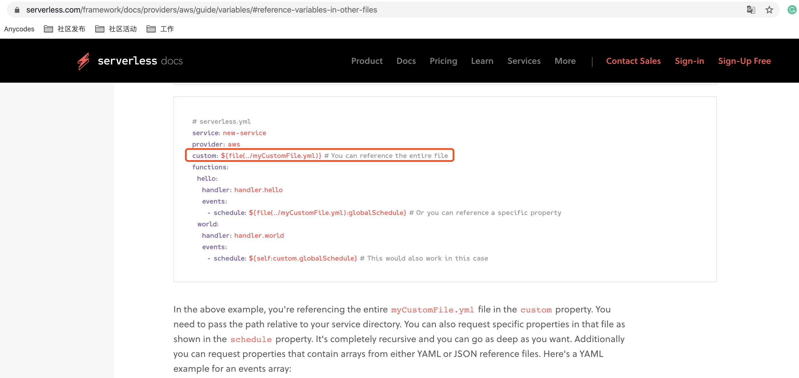

# 第八篇：如何定制化开发Serverless Framework的Component

## 前言

在使用Serverless Framework开发者工具的时候，我们可以发现无论是AWS还是TencentCloud，其运营商与社区都会给我们提供很多组件，供我们选择。虽然这些组件在一定程度上，可以帮助我们解决绝大部分问题，但是在某些时候，我们还可能存在一些定制化需求，那么这个时候，应该如何来解决呢？这个时候可能就需要我们自己来定制化开发我们自己的Component了。

## 开发一个全局变量组件

在使用Serverless Framework Plugin的时候，我们可以看到，他可以设置全局变量，我们在之后的一些引用中，可以直接使用这个全局变量，但是在Component中，并没有全局变量的概念，这就导致一个问题：如果我有多个函数，每个函数都有数据库的配置，难道我要把数据库的配置写多次么？

有人说，当然可以不用写多次，我们完全可以使用`.env`来解决这个问题，例如我们在每个函数中通过`include`引入某个未知的`.env`，将一些配置信息放到这个里面就可以解决。

那么新的问题来了，如果我有多个`.env`文件怎么处理？例如：我有一个`.env.test`，还有一个`.evn.dev`，那么我要批量替换这个引入的文件？还是说要修改文件名？还是？总感觉，再稍微复杂一点的环境中，还是需要一个全局变量，来控制一些事情。

所以我们不妨通过实现一个Component来解决全局变量问题，解决全局变量问题再与`.env`方案结合，我相信可以在生产中获得更大便利：

* 首先第一步，我们要明确我们这个组件具体功能：

> 实现一个全局组件，用户可以在这里配置全局信息，在以后的项目中直接引用，以后修改，可以直接修改这个全局变量的配置就好。

* 接下来我们要明确`yaml`的结构：

这个结构相对来说就很自由了，我的设想是：

```yaml
GlobalComponent:
  component: 'serverless-global'
  inputs:
    key: value
```

这里面，这个组件名字叫`serverless-global`，组件的字段可以用自定义，主要就是`key-value`形式。

* 再然后就是针对这个功能和`yaml`定义动作，我们主要的动作就是，程序执行的时候，会将用户定义的`key-value`完整输出，这样用户就可以在其他组件中引用，例如：

```yaml
GlobalComponent:
  component: 'serverless-global'
  inputs:
    region: ap-beijing
    
ScfComponent_1:
  component: '@serverless/tencent-scf'
  inputs:
    region: ${GlobalComponent.region}
    
ScfComponent_2:
  component: '@serverless/tencent-scf'
  inputs:
    region: ${GlobalComponent.region}
```

* 最后就是项目的开发。

一个标准的Serverless Component的格式是这样的：

```javascript
// serverless.js
const { Component } = require('@serverless/core')
class MyComponent extends Component {
  /*
   * default (必须) : 执行命令 `$ serverless` 会运行此函数
   */
  async default(inputs = {}) {
    return {}
  }

  /*
   * remove (可选) : 执行命令 `$ serverless remove` 会运行此函数， 如果在default中保存了状态，那么此处也必须要存在，否则会报错
   */
  async remove(inputs = {}) {
    return {}
  }

  /*
   * others (可选)：其他功能
   */
  async others(inputs = {}) {
    return {}
  }
}
module.exports = MyComponent
```

对于我们这个GlobalComponent而言，我们是不是只需要把用户的输入内容（`input`），输出就好？

所以，我们的全局变量组件，第一个版本的代码可以是：

 ```javascript
// serverless.js
const { Component } = require('@serverless/core')
class GlobalComponent extends Component {
  async default(inputs = {}) {
    return inputs
  }
}
module.exports = GlobalComponent
```

当然，由于我们在实际生产中，这个全局变量组件可能还有一些额外的用法，例如我是否可以在全局变量组件中直接引入某些Yaml等操作？例如：



其实这种做法还是比较常见的，因为我们可能存在多套配置，完全可以在这里进行不同配置文件的引入。

所以，可以对上面的代码进行进一步完善：

 ```javascript
// serverless.js
const { Component } = require('@serverless/core')
const yamljs = require('yamljs')

class GlobalComponent extends Component {
  async getOutput(inputs = {}, output) {
    const reg = /\${file\(.*?\)}/g
    for (const key in inputs) {
      const regResult = reg.exec(inputs[key])
      if (regResult) {
        const inputPath = inputs[key].slice(7, -2)
        // const file = inputPath[0] == '/' ? inputPath : path.join(process.cwd(), inputPath)
        const yaml = yamljs.load(inputPath)
        const jsonStr = JSON.stringify(yaml)
        const jsonTemp = JSON.parse(jsonStr, null)
        if (jsonTemp) {
          output[key] = await this.getOutput(jsonTemp, {})
        }
      } else {
        output[key] = inputs[key]
      }
    }
    return output
  }

  async default(inputs = {}) {
    const output = {}
    await this.getOutput(inputs, output)
    return output
  }
}

module.exports = GlobalComponent

```
至此，我们完成了一个全局变量组件的开发。

* 当然除了上面说的这种简单的组件，其实在开发过程中，我们还会有一些其他的点需要注意：

1. Serverless Framework Component是会生成一个缓存目录`.serverless`，这个缓存文件怎么来的？

```javascript
this.state = {}
await this.save()
```

可以通过上面的方法，将需要缓存的内容放入`{}`中，进行缓存。

* 如何引用其他组件？

```javascript
const othersComponent = await this.load('@serverless/tencent-scf', 'scf-component');
```

这里面，有两个参数，一个是组件的名字：`@serverless/tencent-scf`，另一个是本次引用的名字：`scf-component`，本次引用的名字怎么理解呢？其实就是这样，在我们的缓存目录会生成很多组件，例如：


这是我部署的一个express之后，生成的缓存目录，这里面可以看到有文件叫这个名字：`Template.express.TencentFramework.apigateway.ap-guangzhou-apigateway`

就针对这条记录而言，这里面引用层为：

tencent-express组件->tencent-framework->tencent-apigateway-mutil-region->tencent-apigateway

那么他每段含义：

> Template: 此处是一个统一的开头

> express: 这个组件的在Yaml中的名字


> TencentFramework: 在tencent-express引用了tencent-framework时候，给他的本次引用的名字（可以不填写，不填写会默认）

> apigateway: 在tencent-framework引用了tencent-apigateway-mutil-region时候，给他的本次引用的名字（可以不填写，不填写会默认）

> ap-guangzhou-apigateway: 在tencent-apigateway-mutil-region引用了tencent-apigateway时候，给他的本次引用的名字（可以不填写，不填写会默认） 

这样做的目的是，为了让我们在移除等操作的时候可以更好的找到资源信息。

## 总结

正如文章开始所说的，我们在做一个项目的时候，社区和官方提供给我们的能力，更多的是通用的，可能无法很好地满足我们的定制化需求，那么这个时候我们就可以通过这样一个方法，开发出自己的组件。

当然，有些时候也是官方或者社区没有提供某种组件，如果我们有兴趣也可以开发，成为一个贡献者。